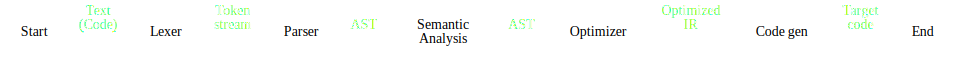
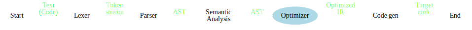
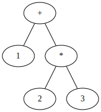
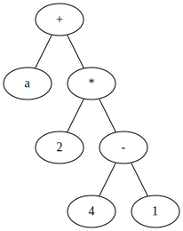
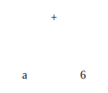
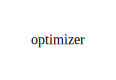
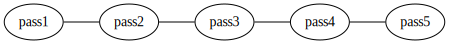
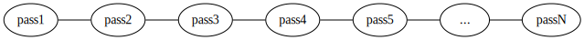

import { Steps, Step } from "../components/Steps"
import Split from "../layouts/Split"
import Markdown from "react-markdown"
import { Notes } from "mdx-deck"
import { components } from "mdx-deck-code-surfer"
import { default as kabisaTheme } from "mdx-deck-kabisa-theme"
import nightOwl from "prism-react-renderer/themes/nightOwl"

export const theme = {
  ...kabisaTheme,
  components: {
    ...kabisaTheme.components,
    ...components
  },
  codeSurfer: {
    ...nightOwl
  }
}


# AST transformations

---

## Table of contents

- Intro + quick recap on ASTs
- AST transformations
- Examples (demo)
- Questions

---

## Structure of a compiler

<Steps>
<Step></Step>
<Step></Step>
</Steps>

---

## Abstract Syntax Trees



Expression: 1 + 2 * 3

<Notes>
This is now the level at which we will be focusing for the rest of the talk.
</Notes>

---

## AST transformations

<Split>
  <Markdown>
    
  </Markdown>
  <Markdown>
    
  </Markdown>
</Split>

<Notes>
<ul>
  <li>Possible to add / modify / simplify information</li>
  <li>Can optimize programs using this way</li>
</ul>
</Notes>

---

## Types of optimizing compilers

<Notes>
Focus on: optimizing
</Notes>

---

### One-pass compiler (the "monolith")



- Optimizations all at once
- Hard to maintain

---

### Micropass compiler


- Smaller, composable optimizations
- ± 5-10 transforms

---

### Nanopass compiler


- Very small, focused optimizations
- 50+ transforms not uncommon
- Easier to maintain, extend, ...

---

### Examples of compiler passes

- Constant folding
- Dead code elimination
- Loop unrolling
- ...

---

## Desugaring expressions

- So far, focus on optimizations
- Transforms can also be used for "code reuse"
- Rewrite expr1 in terms of expr2

---

## Desugaring expressions (2)

- Examples: Racket
- Macros: rewrite code on AST level
- Full power of language during compile time

<Notes>
<ul>
  <li>Lisp mantra: code = data, data = code</li>
  <li>Also called: the programmable programming language</li>
  <li>Full power includes:</li>
  <ul>
    <li>macros expanding to macros</li>
    <li>compile time evaluation</li>
    <li>HTTP requests</li>
    <li>...</li>
  </ul>
  <li>Elixir: also some features possible, but more syntax to explain</li>
</ul>

</Notes>

---

```lisp Examples (1)
42

"abc"

#t  ; also #f

(begin 1 2 3)   ; evaluates to 3

(lambda (x) x)

(define x 5)

(define (identity x)
  x)

(+ 1 2)         ; evaluates to 3

'(+ 1 2)        ; evaluates to (+ 1 2)

`(+ 1 ,x)       ; evaluates to (+ 1 5)

(eval '(+ 1 2)) ; evaluates to 3
-----
1 > numbers
3 > Strings
5 > Booleans
7 > Begin expression
9 > Function definition
11 > Variables
13, 14 > Function definition (using define)
16 > Function application
18 > Quote
20 > Quasiquote / unquote
16:20 > Normal evaluation vs quotation
22 > Evaluation of quoted expressions
```

<Notes>
<ul>
  <li>AST looks the same as the code</li>
  <li>Simple structure => extensible syntax</li>
  <li>Special forms: define, lambda, ...</li>
</ul>
</Notes>

---

```lisp Examples (2)
(if true
  1
  (display "hello world"))  ; evaluates to 1

(define-syntax-rule
  (unless condition false-clause true-clause)
  (if condition true-clause false-clause))

; prints "hello world"
(unless true
  1
  (display "hello world"))

; example usage: (for (1 2 3) displayln)
(define-syntax for
  (syntax-rules ()
    [(for (x) func) (func x)]
    [(for (x y ...) func)
      (begin (func x)
             (for (y ...) func))]))

> (for (1 2 3) displayln)
1
2
3

(define-syntax quoted-for
  (syntax-rules ()
    [(_ (x) func) '(func x)]
    [(_ (x y ...) func)
      `(begin (func x)
             ,(quoted-for (y ...) func))]))

> (quoted-for (1 2 3) displayln)
'(begin (displayln 1)
        (begin (displayln 2)
               (displayln 3)))
----
1:3 > If expressions
5:7 > Define-syntax-rule
9:12 > Our own syntax!
14:20 > Loop example
22:25 > In REPL
27:32 > Variant with quotation
34:37> In REPL
```

<Notes>
<ul>
  <li>define-syntax-rule: add custom syntax</li>
  <li>Evaluated at compile time</li>
  <li>Hygienic macros</li>
  <li>multiple rules: slightly more complex</li>
  <li>Many different variations, since syntax-based macros are defined in term of one another</li>
  <li>also possible: cond, assert, ...</li>
  <li>quoted-X versions for easily showing expanded AST</li>
</ul>
</Notes>

---

## Conclusion

- Technique of representing code/actions as data is very powerful
- Key: minimal set of operations, compose on top
- Only the tip of the iceberg...

---

## Links

- [https://github.com/luc-tielen/talks/ast_transforms](https://github.com/luc-tielen/talks/ast_transforms)
- [https://racket-lang.org/](https://racket-lang.org)
- [https://www.youtube.com/watch?v=Os7FE3J-U5Q](https://www.youtube.com/watch?v=Os7FE3J-U5Q)

---

## Questions?


---

## Next?

- Parser combinators?
- LLVM (code generation)?

