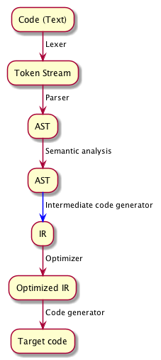

import { Steps, Step } from "../components/Steps"
import { dark } from "mdx-deck/themes"
import nightOwl from "prism-react-renderer/themes/nightOwl"

export { components } from "mdx-deck-code-surfer"
export const theme = {
  ...dark,
  codeSurfer: {
    ...nightOwl,
    showNumbers: false
  }
}

# AST transformations

---

## Table of contents

- Intro + quick recap on ASTs
- AST transformations
- Demo (desugarer)
- Questions

---

## Structure of a compiler

<Steps>
<Step></Step>
<Step></Step>
</Steps>

---

## Intro: Abstract Syntax Trees

- show simple calculation as an example
- emphasize that this is now the level at which we will be focusing

---

## AST transformations

- show picture of a transformation (calculation example, 1 AST to another)
- add / modify / simplify information

---

## Types of optimizing compilers

- initially: monolithic compiler
- then: micropass (few passes)
- taken to the extreme: nanopass (many passes)

(3 slides?)

(use nanopass image here also)
=> small, composable transformations
=> easier to maintain and reason about, reduced complexity

TODO: multiple slides, show concrete examples like constant folding, dead code elimination, ...

---

## Implementation of a nanopass

- based on simple example: nodes, +, *
- traverseAST
- composing traversals => 1 big traversal (= 'desugarer')
- show that it works (based on tests)

---

## Desugaring expressions

- So far, focus was on optimizations
- AST transforms can also be used for code reuse
- Reduces the problem to: can `expr1` be described in terms of `expr2`
- TODO: example

---

## Demo

- Lisp mantra: code = data, data = code
- Also called: the programmable programming language
- AST looks the same as the code
- Simple structure => extensible syntax
- macros are evil, dont use macros => embrace it
- it is possible to focus on a tiny extensible core language, build abstractions on top of that

```notes

Show the following:
- "abc"
- 123
- (+ 1 2)
- eval vs quote
- quasiquote & unquote
- define-syntax-rule

- unless as a macro
- loop as a macro
- ...
- DSL?
```

---

## Conclusion

- Representing code as data can have many benefits, allows for optimization techniques
- Can reinterpret data in multiple ways
- Technique of representing code/actions as data is very powerful
- Composable
- Only the tip of the iceberg...

---

## Questions?


---

## Links

- [https://github.com/luc-tielen/talks/ast_transforms](https://github.com/luc-tielen/talks/ast_transforms)
- [https://racket-lang.org/](https://racket-lang.org)

---

## Next?

- Parser combinators?
- LLVM (code generation)?

