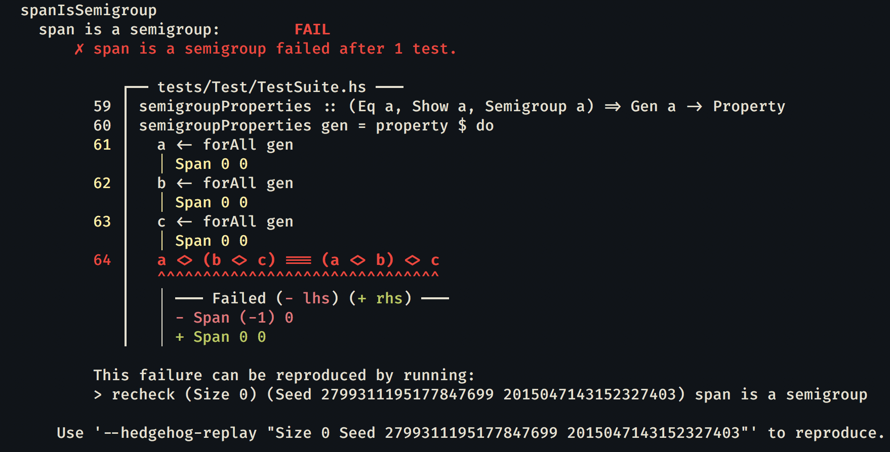
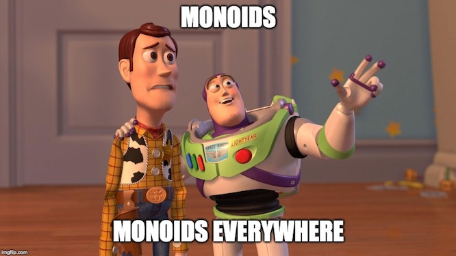

import Title from "../../components/Title";
import SVG from "../../components/SVG";
import VennDiagram from "../../components/VennDiagram";
import { components } from "mdx-deck-code-surfer"
import { withCodeSurfer } from "mdx-deck-kabisa-theme"
import { CodeSurfer } from "mdx-deck-code-surfer";
export const theme = withCodeSurfer(CodeSurfer)


<SVG contents={require("./images/haskell_logo.svg")} width="20%"/>
<Title contents="Semigroups and monoids"/>

```haskell
palindrome :: String -> String
palindrome = id <> reverse

-- In REPL:
palindrome "Semigroups and monoids"
```

```notes
- Syntax is now mostly behind us, now it will be mostly concepts
```

---

## Table of contents

- Introduction
- Semigroups
- Monoids
- Foldable
- Exercises

---

## Introduction

- Haskell is *value-focused*
- In what possible ways can we combine values?

```haskell
-- Numbers: combinable in 2 ways
1 + 2
3 * 4

-- Lists and strings: 1 way to combine
[1, 2, 3] ++ [4, 5, 6]
"abc" ++ "def"
```

---

## Introduction

- Can we generalize this idea?

```haskell
(+)  :: Num a => a      -> a      -> a
(*)  :: Num a => a      -> a      -> a
(++) ::          String -> String -> String
```

---

```haskell Semigroups (in Haskell)
class Semigroup a where
  -- read as: "append" operator
  (<>) :: a -> a -> a
  sconcat :: NonEmpty a -> a
  stimes :: Integral b => b -> a -> a
  {-# MINIMAL (<>) #-}


-- Some example instances
instance Semigroup [a] where
  a <> b = a ++ b
  -- can also be written as: (<>) = (++)

instance Semigroup (First a) where
  a <> _ = a

instance Semigroup (Last a) where
  _ <> b = b

-- there are *many* other instances for other datatypes!
-- (enter ":i Semigroup" in REPL)
----
1:6 > Semigroup typeclass
9:12 > Implementation for lists
14:15 > Implementation for "first"
17:21 > Implementation for "last"
```

---

## Semigroups (in Haskell)

- Multiple solutions possible? &#x2192; newtypes!

```haskell
newtype Sum = Sum Int
newtype Product = Product Int

instance Semigroup Sum where
  (Sum a) <> (Sum b) = Sum (a + b)

instance Semigroup Product where
  (Product a) <> (Product b) = Product (a * b)
```

```notes
- These are dumbed down versions of the actual datatypes, to focus more on the newtypes in combination with typeclasses
- Some wrapping and unwrapping is needed, but this can be automated away mostly.
- Tip: `:i Semigroup` in REPL
```

---

## Semigroups (in math)

> A semigroup is an **algebraic structure** consisting of a **set** together with an **associative binary operation**.

```notes
Definition as found on wikipedia. https://en.wikipedia.org/wiki/Semigroup
Showing more mathy terms to get more acquainted with it
```

---

## Semigroups (for programmers)

1. **algebraic structure**: a type (ADT)
2. **set**: all possible values a type can assume
3. **associative binary operation**: function that combines 2 values

---

## Semigroup laws

1. a <> (b <> c) = (a <> b) <> c

```notes
- Laws always have to be valid, to avoid unexpected behavior when people use a typeclass
- Associativity has important consequences: easy to parallellize, order doesn't matter! (map reduce, ...)
```

---

```haskell Quick detour to PBT
-- In Span.hs
type Pos = Int
data Span = Span Pos Pos
  deriving (Eq, Show)

instance Semigroup Span where
  (Span start1 end1) <> (Span start2 end2) =
    Span (min start1 start2) (max end1 end2)


-- In a helper file for tests
import Hedgehog

semigroupProperties :: (Eq a, Show a, Semigroup a) => Gen a -> Property
semigroupProperties gen = property $ do
  a <- forAll gen
  b <- forAll gen
  c <- forAll gen
  a <> (b <> c) === (a <> b) <> c

-- In test file
import Hedgehog
import Test.Tasty
import Test.Tasty.Hedgehog
import qualified Hedgehog.Range as Range
import qualified Hedgehog.Gen as Gen


test_spanIsSemigroup :: [TestTree]
test_spanIsSemigroup = [testProperty "span is a semigroup" spanIsSemigroup]


spanGen :: Gen Span
spanGen =
  let range = Range.linear 0 10000
   in Span <$> Gen.int range
           <*> Gen.int range

spanIsSemigroup :: Property
spanIsSemigroup = semigroupProperties spanGen
----
1:8 > Span semigroup definition
11:19 > Generic property helper (works for all semigroups!)
21:26 > Some imports
29:30 > Hooking property into the test suite
33:37 > Generator for a span
39:40 > Actual property
```

```notes
- Short example of how to do property based testing
- Generator can be reused for other properties
- Helpers can be defined for testing common properties of data types
- Helpers closely resembles the initial laws
```

---

## Quick detour to PBT

```haskell
-- Bad instance to showcase errors:
instance Semigroup Span where
  (Span begin1 end1) <> (Span begin2 end2) =
    let badStart =
          if begin1 `mod` 2 == 0
            then begin1 - 1
            else begin2
    in Span badStart (max end1 end2)
```

---

## Quick detour to PBT



---

## Monoids

- Similar to semigroup, also has **neutral element**
- Extra requirements &#x2192; less monoids than semigroups
- But: more power / usable in more situations

<VennDiagram data={[
  { values: ["Monoids"], size: 1 },
  { values: ["Semigroups"], size: 5 },
  { values: ["Semigroups", "Monoids"], size: 1 }
  ]} />

---

```haskell Monoids in Haskell
class Semigroup a => Monoid a where
  mempty :: a
  mconcat :: [a] -> a
  mappend :: a -> a -> a  -- same as (<>) in Semigroup
  {-# MINIMAL mempty #-}

instance Monoid [a] where
  mempty = []

instance Monoid Sum where
  mempty = Sum 0

instance Monoid Product where
  mempty = Product 1
----
1:5 > Monoid typeclass
7:8 > Implementation for lists
10:11 > Implementation for sums
13:14 > Implementation for products
```

---

## Monoid laws

1. a <> (b <> c) = (a <> b) <> c
2. mempty <> a = a <> mempty = a

```notes
Can write hedgehog tests for this too!
```

---

```haskell Some more examples
newtype All = All Bool
newtype Any = Any Bool

instance Semigroup All where
  (All a) <> (All b) = All (a && b)

instance Monoid All where
  mempty = All True

instance Semigroup Any where
  (Any a) <> (Any b) = Any (a || b)

instance Monoid Any where
  mempty = Any False

instance Semigroup b => Semigroup (a -> b) where
  f1 <> f2 = \\a -> f1 a <> f2 a

instance Monoid b => Monoid (a -> b) where
  mempty = \\a -> mempty  -- or: const mempty
----
1:14 > All and any monoids
16:20 > Function monoid
```

```notes
Note: since functions are curried, this will work for any arity function where last argument is monoid!
```

---

```haskell Foldable typeclass
class Foldable (t :: * -> *) where
  fold :: Monoid m => t m -> m
  foldMap :: Monoid m => (a -> m) -> t a -> m
  foldr' :: (a -> b -> b) -> b -> t a -> b
  foldl' :: (b -> a -> b) -> b -> t a -> b
  foldr1 :: (a -> a -> a) -> t a -> a
  foldl1 :: (a -> a -> a) -> t a -> a
  foldr :: (a -> b -> b) -> b -> t a -> b
  foldl :: (b -> a -> b) -> b -> t a -> b
  toList :: t a -> [a]
  null :: t a -> Bool
  length :: t a -> Int
  elem :: Eq a => a -> t a -> Bool
  maximum :: Ord a => t a -> a
  minimum :: Ord a => t a -> a
  sum :: Num a => t a -> a
  product :: Num a => t a -> a
  {-# MINIMAL foldMap | foldr #-}
----
* > Foldable typeclass
1:7 > Most interesting functions
```

```notes
- Foldable defines all kinds of folds
- foldr' / foldl': strict variants, the others are more likely to cause space leaks
- Some functions of Foldable work for any monoid
- Watch out: foldr1 and foldl1 can raise exceptions (not total!)
```

---

```haskell Foldable in action
-- in Repl:
> foldMap (+1) [Sum 1, Sum 2, Sum 3]
Sum {getSum = 9}

> foldMap (+1) $ Node (Sum 1) [Node (Sum 2) [], Node (Sum 3) []]
Sum {getSum = 9}

> fold $ Node (Sum 1) [Node (Sum 2) [], Node (Sum 3) []]
Sum {getSum = 6}

> fold $ Node [Sum 1]
          [ Node [Sum 2, Sum 3] []
          , Node [Sum 4] []
          ]
[Sum {getSum = 1},Sum {getSum = 5},Sum {getSum = 4}]

> fold . fold $ Node [Sum 1]
                  [ Node [Sum 2, Sum 3] []
                  , Node [Sum 4, Sum 5] []
                  ]
Sum {getSum = 15}
----
1:3 > Mapping + folding lists
5:6 > Mapping + folding trees
8:9 > Folding trees
11:15 > Folding: Tree [Sum Int] to [Sum Int]
17:21 > Folding: Tree [Sum Int] to Sum Int
```

```notes
- Very easy to add / remove a layer of monoids, keeps working!
```

---

```haskell Final example: multiple configurations
type Port = Int

data PartialConfig
  = PartialConfig
  { pcPort :: Last Port
  , pcCertFile :: Last Path
  -- other options ...
  }

instance Semigroup PartialConfig where
  a <> b =
    -- following 2 lines have similar behavior
    let port = pcPort a <> pcPort b
        certFile = foldMap pcCertFile [a, b]
    in PartialConfig port certFile

instance Monoid PartialConfig where
  mempty = PartialConfig mempty mempty


data Config
  = Config
  { cPort :: Port
  , cCertFile :: Path
  -- other options ...
  }

type ConfigError = Text


toConfig :: Port -> PartialConfig -> Either ConfigError Config
toConfig defaultPort config = do
  let port = fromMaybe defaultPort $ getLast $ pcPort config
  certFile <- note "Missing cert file location" $ getLast $ pcCertFile config
  -- process other options...
  pure $ Config port certFile

-- Pretend some of these functions exist and all return partial configs
getConfig :: IO (Either ConfigError Config)
getConfig = do
  homeDir <- getHomeDirectory
  homeConfig <- parseFileConfig (homeDir </> "my-config.yaml")
  currentDirConfig <- parseFileConfig ("." </> "my-config.yaml")
  cliConfig <- parseCLIConfig
  pure $ toConfig 8000 $ fold [homeConfig, currentDirConfig, cliConfig]
----
1:8 > Defining a composable config type
10:18 > Semigroup and monoid instances
21:26 > Actual config data type
28 > Type synonym for readability
31:36 > Function for computing actual config
38:45 > Composing partial configs into 1 result (later values win)
```

```notes
- "note" is from errors package (Control.Error.Util)
- "getHomeDirectory" is from System.Directory
- (</>) operator is from System.FilePath
- Note: Only last function uses IO
```

---

## Conclusion



- Lots of opportunities for composing values
- Easy to use
- Can greatly simplify code

---

## Not mentioned today

- [Magmas](http://hackage.haskell.org/package/magma)
- [Groups](http://hackage.haskell.org/package/groups)

---

## Links

- [Magmas, semigroups and monoids](http://miranpark.com/posts/magmas-semigroups-and-monoids-oh-my/)
- [Diagrams package](https://archives.haskell.org/projects.haskell.org/diagrams/gallery.html)

---

## Next time

- Functors

---

## Exercises

- Try thinking of other semigroups and monoids
- Write instances for them
- Remaining exercises of last time
- build a simple TODO list app

