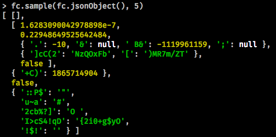

import { Steps, Step } from "../components/Steps"
import SVG from "../components/SVG"
import Split from "../layouts/Split"
import Markdown from "react-markdown"
import { components } from "mdx-deck-code-surfer"
import { withCodeSurfer } from "mdx-deck-kabisa-theme"
import { CodeSurfer } from "mdx-deck-code-surfer";
export const theme = withCodeSurfer(CodeSurfer)


# Property based testing

---

## Who am I


Luc Tielen (<strong>@luctielen</strong>)

---

## Table of contents

- A quick recap: unit tests
- Property based testing
  - Key concepts
  - Examples
- Questions

---

## A quick recap: unit tests

```javascript
describe("my first unit test", () => {
  it("verifies expected behavior", () => {
    expect(1 + 1).to.eql(2);
  });
})
```


---

## A quick recap: unit tests

- Great for checking expected behavior
- But: think out examples manually

---

## Property based testing


- Describe behavior of code in terms of "properties"
- Origin: Haskell (QuickCheck)
- Not: exhaustive checking &#x2192; formal verification

---

## Property based testing

- Javascript: numerous implementations
- Today: [JSverify](https://github.com/jsverify/jsverify)
- Side by side with unit tests
- __yarn add --dev jsverify__

```javascript
describe("addition", () => {
  property("addition is commutative", "nat", "nat",
    (a, b) => a + b === b + a
  );
});
```

```notes
- Hooks cleanly into Mocha
- "property": like "it", but checks a property many times
- for more difficult usecases: fall back to it again
- Generators: discussed later on
```

---

## High level view

<SVG contents={require("./schematics/high_level_view_sut.dot")}
     width="75vw"/>

- System under test = SUT
- Data in, data out

```notes
Important, no side effects!
```

---

## High level view (2)

<SVG contents={require("./schematics/high_level_view_unit_test.dot")}
     width="75vw"/>

- Single iteration
- Manual created inputs
- Assertions on output

---

## High level view (3)

<SVG contents={require("./schematics/high_level_view_property_test.dot")}
     width="75vw"/>

- Many iterations
- Random data
- Assertions: relations between in- and outputs!

---

## Generators

- "Directed" randomness: e.g. -1, 0, 1, NaN, undefined, unicode, ...
- Framework uses generators to automatically create input data
- Composable

---

```javascript Generators
const jsc = require("jsverify");

const arbitraryTime = jsc.record({
  hours: jsc.integer(0, 23),
  minutes: jsc.integer(0, 59),
  seconds: jsc.integer(0, 59)
});

describe("time", () => {
  property(
    "time generator generates valid times",
    arbitraryTime,
    time => true // property that uses random time...
  );
});
----
* > Example
3:7 > Definition
3[2], 12 > Hook generator into property
13 > Actual usage
```

---

## Generators

```javascript
const jsc = require("jsverify");
const sampler = jsc.sampler(jsc.json, 100);
sampler(20)
```



```notes
- jsc.json = another builtin generator
- Who would write this input data by themselves? ==> much more thorough!
- Can prototype generators in REPL
```

---

## Shrinking

TODO (./images/shrinking_example.png)

- Failing property: contains random, possibly complex data
- Useful if it would find simpler case

---

## Shrinking (2)

TODO (./images/shrinking_algorithm.png)

- Repeatedly try with simpler data until test doesn't fail
- &#x2192; previous test is 'minimal' example
- Example: generated a = 125, a < 100

---

## Business logic example

- TODO bank example

---

## "Parallel map" example

- TODO find good counterpart for javascript

---

## Good candidates for PBT

- Business logic (domain layer)
- Pure code in general
- Note: executed many times &#x2192; has to be fast!

---

## Common patterns in PBT

- Commutativity: a + b = b + a
- Associativity: a + (b + c) = (a + b) + c
- Idempotency: f(f(x)) = f(x)
- Encode + decode = no-op
- Checking against simplified model
- Checking domain invariants (business rules)
- ...

---

## Testing stateful systems

- Properties so far: no external state across function calls
- TODO check if possible with JSverify
- Out of scope for today

---

## Conclusion

- PBT is a powerful tool in a developers arsenal
- More initial thinking
- Big payoff
- But: not everything is a nail!

---

## Reading material

- [https://github.com/luc-tielen/talks](https://github.com/luc-tielen/talks)
- [https://en.wikipedia.org/wiki/QuickCheck](https://en.wikipedia.org/wiki/QuickCheck)
- [https://github.com/jsverify/jsverify](https://github.com/jsverify/jsverify)
- [https://kabisa.nl](https://kabisa.nl)
- [https://theguild.nl](https://theguild.nl)

---

## Questions?

